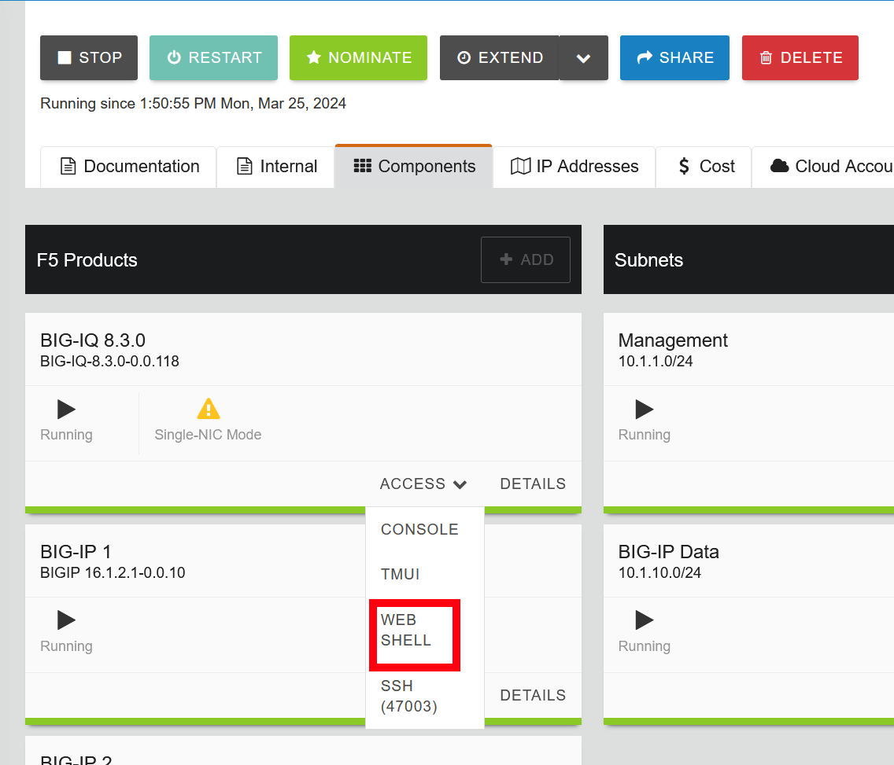

.. _install-script:

Exercise 1: Installing Usage Script
===================================

.. important:: Complete :ref:`Exercise 1<unmanaged-change>` first.

#. Access the BIG-IQ Command Line Interface (CLI) via the UDF Web console, by selecting the Components tab, then selecting *Access* on the BIG-IQ F5 Products Tile, and then click the *WEB SHELL* link on the dropdown.

#. On the **Change License** screen, assign a new license from the **F5-BIG-MSP-BT-1G-LIC-DEV** offering using the
   following parameters, and then click **Assign**:

   * **Username:** admin
   * **Password:** !f5admin
   * **License Type:** Utility
   * **Name:** LOADV4
   * **Offering:** F5-BIG-MSP-BT-1G-L
